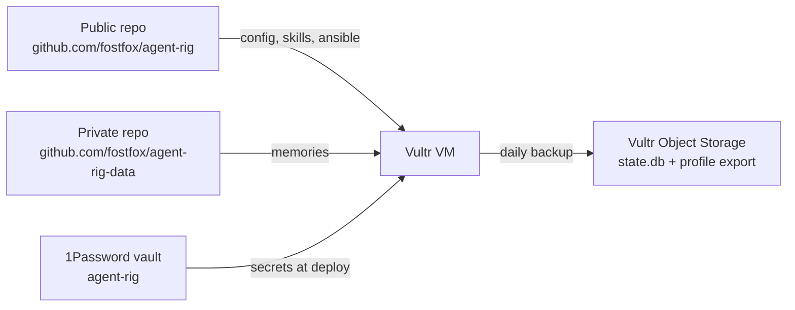

# agent-rig

Provisioned dev VM with pre-configured agent tools.
Ansible + GitHub Actions + 1Password.

## Architecture



Three repos, one VM:

| Repo | Access | Contents |
|------|--------|----------|
| **agent-rig** (this one) | public | distribution, config, SOUL, skills, ansible, CI/CD |
| **agent-rig-data** | private | `memories/MEMORY.md`, `memories/USER.md` — synced both ways |
| **Vultr OS (S3)** | private | Daily `state.db` + `hermes profile export` backups, 30-day retention |

## What's on the VM

| Tool | How |
|------|-----|
| Hermes CLI | OpenRouter, `deepseek/deepseek-v4-flash` |
| `gh` | Authenticated as `pipo-robot` (GitHub App) |
| `yc` | Yandex Cloud SA key |
| Docker | Installed |
| Workspace | `~/dev/` — short paths |

## Sync

```
┌─────────────────┐          ┌─────────────────┐
│  agent-rig      │──pull──→ │  ~/.hermes/      │
│  (public)       │  10min   │  config, SOUL,   │
│  config/skills  │          │  skills          │
└─────────────────┘          └──────┬──────────┘
                                    │ push
                                    │ when memory
                                    │ changes
                                    ▼
┌─────────────────┐          ┌─────────────────┐
│  agent-rig-data │←──push── │  ~/.hermes/      │
│  (private)      │  10min   │  memories/       │
│  MEMORY.md      │          │  USER.md         │
│  USER.md        │          │                  │
└─────────────────┘          └─────────────────┘
                                    │
                                    │ daily at 3AM
                                    ▼
                          ┌─────────────────┐
                          │  Vultr OS (S3)   │
                          │  state.db        │
                          │  profile export  │
                          │  30-day retention│
                          └─────────────────┘
```

## Deployment

Push to main → GH Actions runs Ansible:

```bash
# Manually:
gh workflow run deploy-vm.yml -f plan=vc2-2c-4gb -f region=fra

# Or push changes to ansible/ or .github/workflows/
```

## Credentials

All secrets live in **1Password** (vault: `agent-rig`).
The only GitHub secret: `OP_SERVICE_ACCOUNT_TOKEN`.

## Repo layout

```
├── distribution.yaml       ← Hermes profile manifest
├── hermes.yaml             ← agent config (no secrets)
├── SOUL.md                 ← agent identity
├── skills/                 ← custom skills
├── ansible/                ← VM provisioning
├── .github/workflows/      ← deploy + backup
└── AGENTS.md               ← rules for agents working here
```

Try it: `hermes profile install fostfox/agent-rig`
